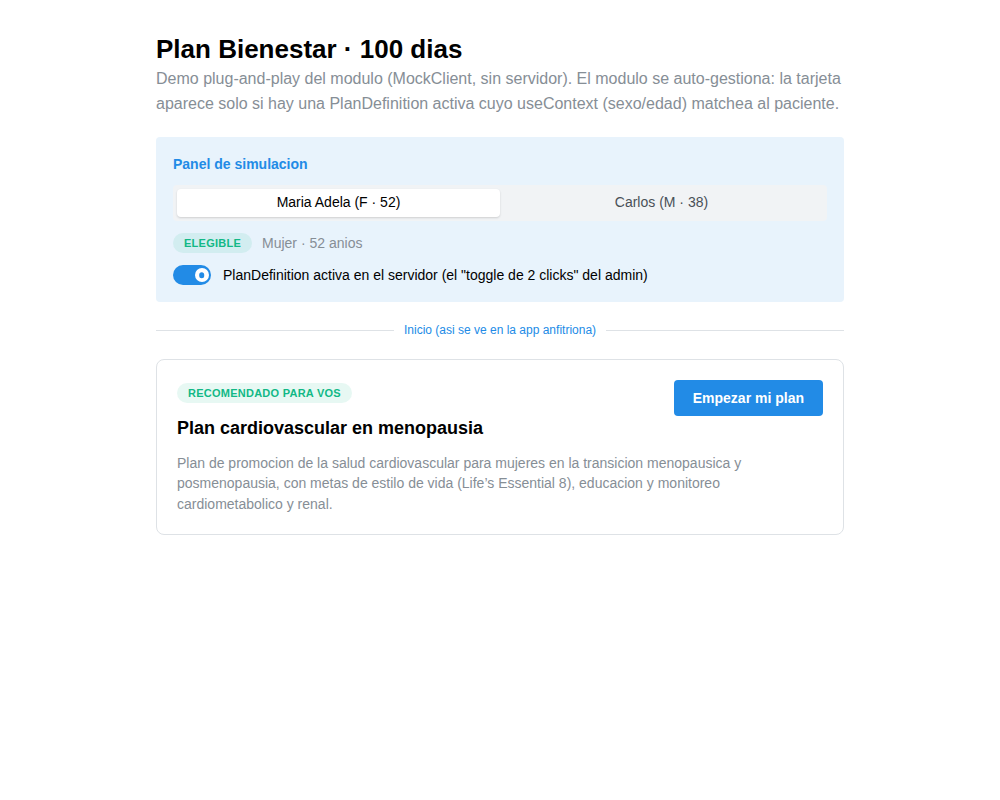
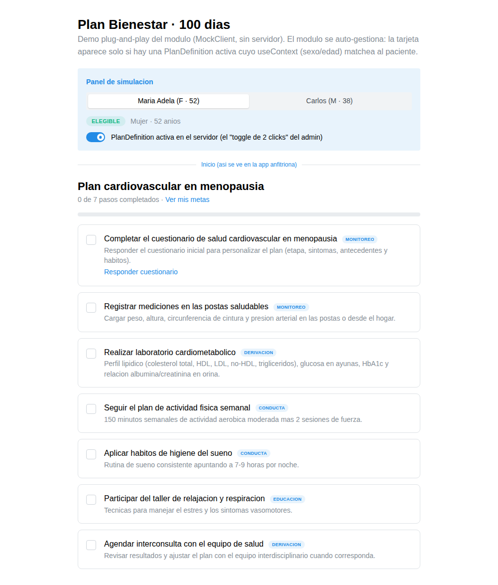
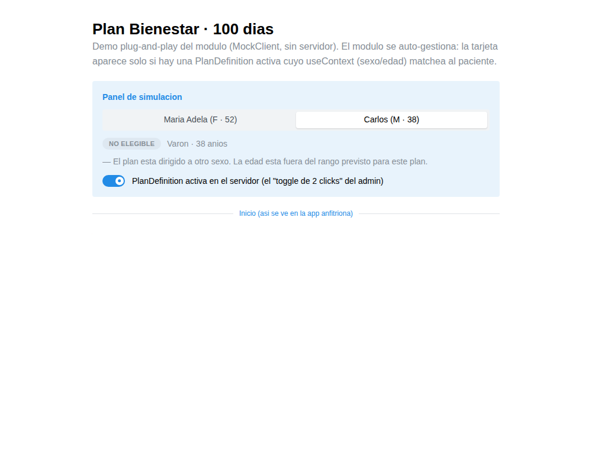
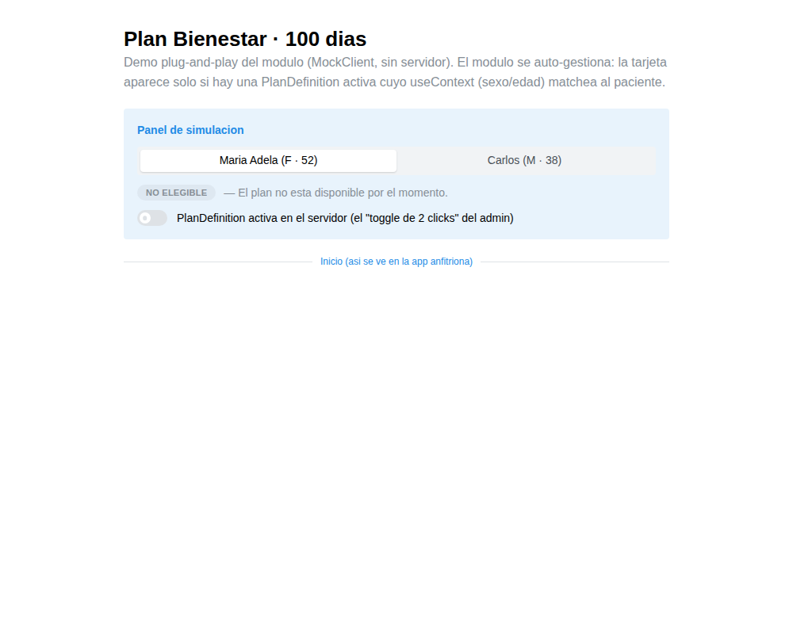

# Plan Bienestar 100 Días · Salud CardioMetabólica

Monorepo del **Plan Bienestar 100 Días** (EPA Bienestar IA / Favaloro Medplum Argentina): recursos **FHIR R4** y un **módulo React plug-and-play** para promover la salud cardiovascular-renal-metabólica (CKM, AHA/Ndumele), comenzando por la **salud cardiovascular de la mujer en menopausia** (AHA/El Khoudary).

Pensado para integrarse en cualquier app basada en **FooMedical / Medplum** (por ej. [EPA-Developments/app](https://github.com/EPA-Developments/app) — Segunda Opinión Médica, o [drdalessandro/app](https://github.com/drdalessandro/app)).

## La estrategia plug-and-play

La elegibilidad ("mujer de 45 a 65 años") **no vive en el código de las apps: vive en el servidor FHIR**, declarada en el `useContext` de una `PlanDefinition`. El módulo React es idéntico en todas las apps y se auto-gestiona:

```
┌─────────────────────────────┐      ┌──────────────────────────────────┐
│  Servidor Medplum (FHIR)    │      │  App anfitriona (FooMedical)     │
│                             │      │                                  │
│  PlanDefinition             │◄─────│  <PlanBienestarCard />           │
│   status: active/retired    │ lee  │   └─ useElegibilidad()           │
│   useContext:               │      │       ¿matchea sexo + edad?      │
│    gender = female          │      │        sí → muestra tarjeta      │
│    age    = 45..65          │      │        no → no renderiza nada    │
│                             │      │                                  │
│  CarePlan + Goal + Task ... │◄─────│  "Empezar mi plan"               │
│  (instantiatesCanonical)    │ crea │   └─ Bundle transaccional        │
└─────────────────────────────┘      └──────────────────────────────────┘
```

### Integración en la app anfitriona: 2 líneas

```tsx
// HomePage.tsx
<PlanBienestarCard />

// Router.tsx (dentro del área /care-plan que FooMedical ya tiene)
<Route path="/care-plan/plan-100-dias/*" element={<PlanBienestarRoutes />} />
```

### Gestión: 2 clicks, sin redeploy

1. **Click 1:** en el Medplum App, abrir la `PlanDefinition` "Plan cardiovascular en menopausia".
2. **Click 2:** cambiar `status` (`active` ⇄ `retired`) o editar el rango de edad del `useContext` y guardar.

Todas las apps que montan el módulo reflejan el cambio al instante. Mañana se agrega una `PlanDefinition` "Salud CV del Hombre 40–60" con otro `useContext` y el mismo módulo la ofrece — así se escala a las demás fases de la guía CKM sin reescribir nada.

## Paquetes

| Paquete | Qué es |
| --- | --- |
| [`@epa/careplan-menopausia`](packages/careplan-menopausia) | Capa de datos: fábrica de recursos FHIR R4 (`PlanDefinition`, `CarePlan`, `Goal`, `Task`, `CareTeam`, `Questionnaire`, `Condition`), plantilla clínica y evaluador de elegibilidad. Sin dependencias de UI. |
| [`@epa/plan-bienestar-react`](packages/plan-bienestar-react) | Módulo React drop-in: `<PlanBienestarCard />`, `<PlanBienestarRoutes />` (pasos / metas / cuestionario), `useElegibilidad()`, `usePlanBienestar()`. Peer deps compatibles con FooMedical (React ≥18, `@medplum/react` ≥3.1, Mantine ≥7, react-router ≥6.4). |
| [`apps/demo`](apps/demo) | Demo local sin servidor (`MockClient`) que muestra el auto-gating en vivo. |

## Demo

```bash
npm install
npm run demo   # abre Vite en http://localhost:5173
```

| El módulo decide solo, por datos | |
| --- | --- |
|  | María Adela (F, 52): la tarjeta aparece con CTA. |
|  | "Empezar mi plan" crea el `CarePlan` + 10 `Goal` + 7 `Task` en una transacción y muestra los pasos. |
|  | Carlos (M, 38): mismo código, sin tarjeta. |
|  | El admin retira la `PlanDefinition` (los "2 clicks"): la tarjeta desaparece para todos, sin redeploy. |

## Base clínica

- **CKM Health** — Ndumele et al., *Cardiovascular-Kidney-Metabolic Health: A Presidential Advisory From the AHA*, Circulation 2023.
- **Menopausia y riesgo CV** — El Khoudary et al., *Menopause Transition and Cardiovascular Disease Risk*, Circulation 2020.
- **Life's Essential 8 (AHA)** — columna vertebral de las metas de estilo de vida.

> Esta versión es una *plantilla de plan* (metas, educación, monitoreo). La estadificación CKM 0–4 y el score de riesgo (PREVENT) están en el roadmap. Los umbrales son valores de prevención por defecto y deben individualizarse por el equipo de salud. Ver además la [verificación pendiente de códigos SNOMED](packages/careplan-menopausia/README.md#%EF%B8%8F-verificaci%C3%B3n-de-c%C3%B3digos-snomed-ct).

## Desarrollo

```bash
npm install        # workspaces: packages/* y apps/*
npm run build      # compila core + react + demo
npm test           # vitest en todos los paquetes (24 + 8 tests)
npm run typecheck
```

## Setup en un proyecto Medplum real

```ts
import { asegurarPlanDefinition } from '@epa/plan-bienestar-react';

// Una sola vez por proyecto (idempotente): publica la PlanDefinition.
await asegurarPlanDefinition(medplum);
```

Después, la gestión es 100% desde el Medplum App (los 2 clicks).

## Roadmap

1. ~~Recursos FHIR R4 del CarePlan de menopausia (plantilla)~~ ✅
2. ~~Módulo React drop-in + PlanDefinition con `useContext` + demo~~ ✅
3. Estadificación CKM 0–4 (Ndumele) como clasificación/`Observation`.
4. Estratificación de riesgo (PREVENT) que module metas y seguimiento.
5. Perfiles AR Core (msal.gob.ar) y otras etapas de la vida (embarazo, posparto, hombre 40–60, …).

## Licencia

Apache-2.0
